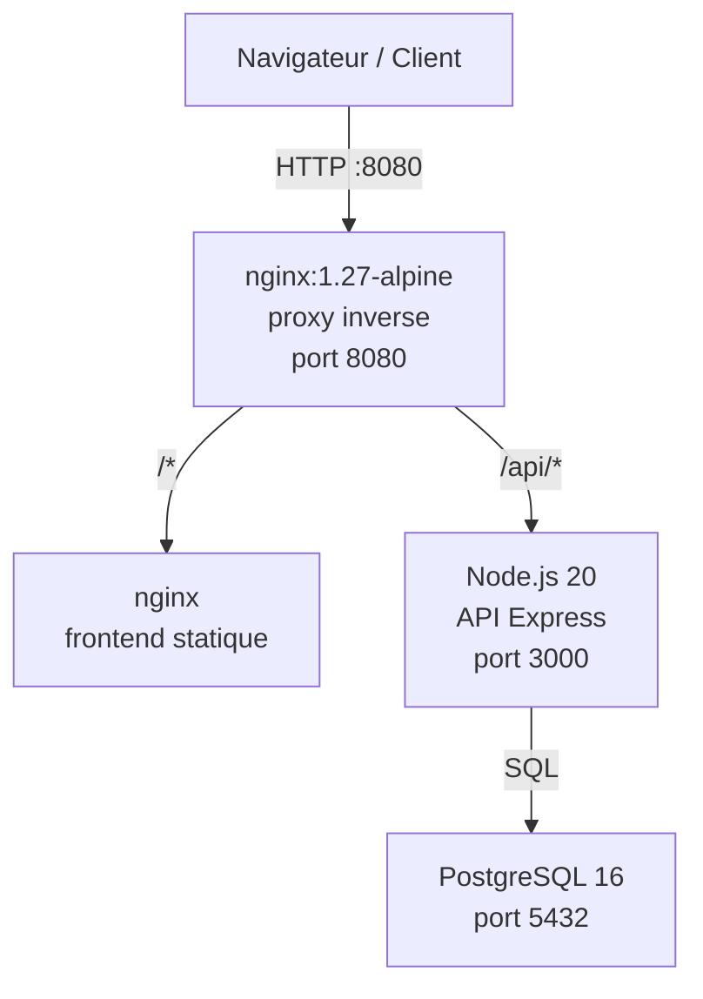
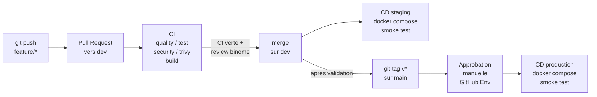
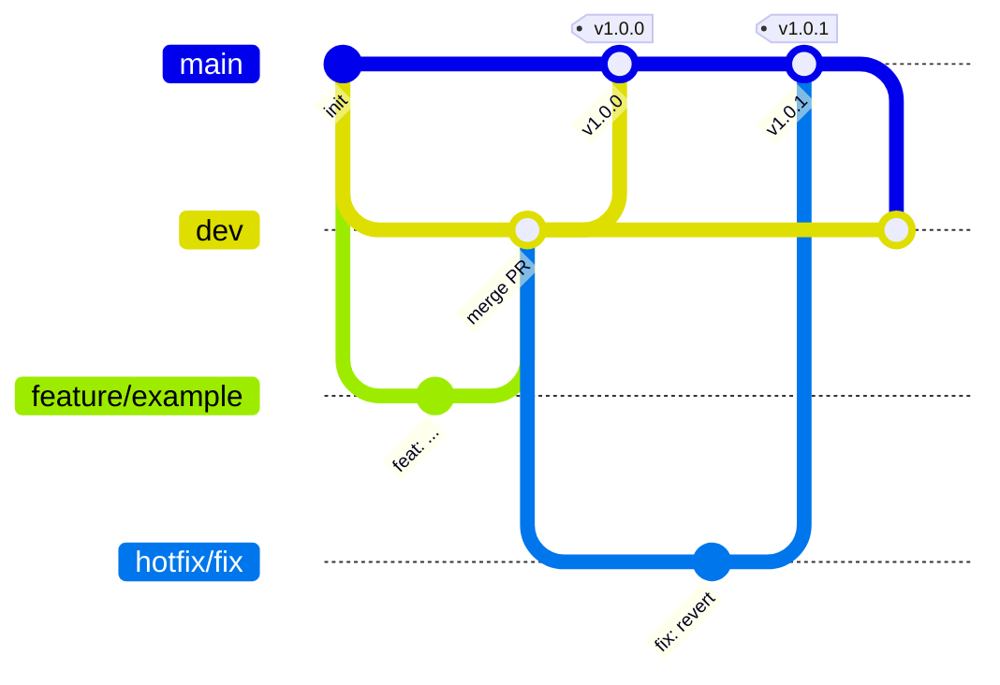

# Architecture

Vue d'ensemble de l'architecture du projet ShopLite.

## Infrastructure (Docker Compose)

Tous les services communiquent sur le reseau Docker interne `shoplite_net`.
Seul le proxy expose un port vers l'hote.

## Flux de deploiement CI/CD

## Strategie de branches

## Couches applicatives

| Couche | Technologie | Role |
|--------|-------------|------|
| Proxy | nginx 1.27 Alpine | Reverse proxy, routage /api/* et /* |
| Frontend | HTML/CSS/JS + nginx | Interface utilisateur statique |
| API | Node.js 20 + Express | Logique metier, endpoints REST |
| Base de donnees | PostgreSQL 16 Alpine | Persistance des donnees |
| Observabilite | Logs JSON (stdout) | `level`, `request_id`, `duration_ms` |

## Variables d'environnement cles

| Variable | Valeur par defaut | Role |
|----------|-------------------|------|
| `DATABASE_URL` | `postgres://...@db:5432/shoplite` | Connexion PostgreSQL |
| `API_PORT` | `3000` | Port interne de l'API |
| `LOG_LEVEL` | `info` | Niveau de log (debug/info/warn/error) |
| `APP_VERSION` | `starter` | Version affichee dans /health |
| `HTTP_PORT` | `8080` | Port expose par le proxy |
